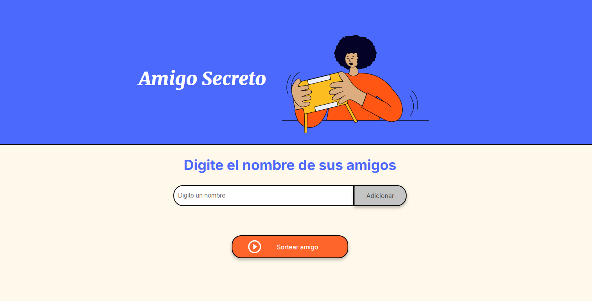

# Challenge Amigo Secreto
En este challenge se realizo es una aplicación que permite a los usuarios ingresar nombres de amigos en una lista para luego realizar un sorteo aleatorio y determinar quién es el "amigo secreto".
El usuario deberá agregar nombres mediante un campo de texto y un botón "Adicionar". Los nombres ingresados se mostrarán en una lista visible en la página, y al finalizar, un botón "Sortear Amigo" seleccionará uno de los nombres de forma aleatoria, mostrando el resultado en pantalla.

     

## :hammer: Funcionalidades
- `Funcionalidad 1- Agregar nombres:` Los usuarios escribirán el nombre de un amigo en un campo de texto y lo agregarán a una lista visible al hacer clic en "Adicionar".

- `Funcionalidad 2- Validar entrada:` Si el campo de texto está vacío, el programa mostrará una alerta pidiendo un nombre válido.

- `Funcionalidad 3- Visualizar la lista:` Los nombres ingresados aparecerán en una lista debajo del campo de entrada.

- `Funcionalidad 4- Sorteo aleatorio:` Al hacer clic en el botón "Sortear Amigo", se seleccionará aleatoriamente un nombre de la lista y se mostrará en la página.

##  :computer: Tecnologías utilizadas
Para la realización de este proyecto he utilizando:

## :loudspeaker: Desarrollo

### Trello :date:
Para desarrollar el proyecto, trabaje con el sistema ágil de desarrollo utilizando Trello de la siguiente forma:

1. La columna **Listos para iniciar** presenta las tarjetas con elementos que aun no fueron desarrollados.

2. En la columna **En Desarrollo** estarán las tarjetas que estés desarrollando en el momento.

3. En la columna **Pausado** estarán los elementos que has comenzado a trabajar pero necesitas detener por algún motivo.

4. Por fin, en la columna **Concluido** estarán los elementos ya finalizados.

:link:**Link de Trello:** [Challenge Amigo Secreto - ESP](https://trello.com/b/v0TFbgqP/trello-challenge-amigo-secreto-esp#)

## :pushpin: Acceso al proyecto

Puedes acceder al código fuente del proyecto [aquí](https://gabiif.github.io/challenge-amigo-secreto/)